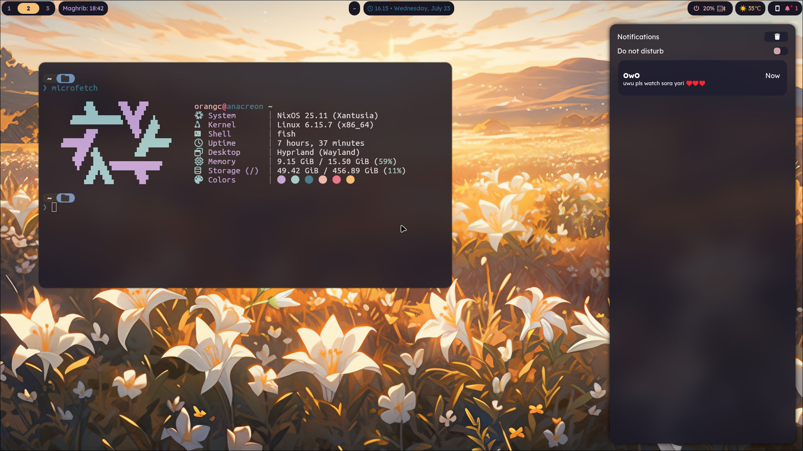
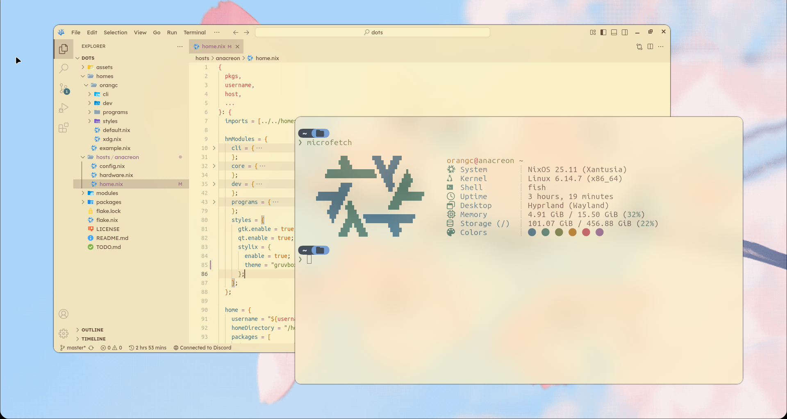

      <h1>orangc's flake</h1>
      

         
         <!--  -->
         
         
      

> [!CAUTION]
> This flake is meant for my personal usage. Use at your own risk. Several (mostly the server related) modules utilise [secrets](./docs/secrets.md) and are inoperable without them.
> Going through my code for little bits and things to borrow or learn from is totally fine (as long as you respect the license and credit me appropriately).
> This flake is very much a work in progress; I'm constantly working on improving it and I have many things planned for it in the future.

Modular NixOS configuration for my machines. Very lightweight! A fresh installation of this flake (with the modules enabled in [komashi](./hosts/komashi/config.nix)) will be *18 gigabytes*, which isn't bad at all in my opinion.

Hosts:
- komashi ~ My main computer; a HP EliteDesk mini PC with an Intel i5-6500T, integrated graphics, 16GiB of RAM, and a 512GiB NVMe SSD. Name is a reference to *Yumi and the Nightmare Painter*.
- sirius ~ Not an actual computer. A portable USB meant to be plugged in and booted from live. Name is a reference to *Foundation*.
- gensokyo ~ My homelab/server. A HP EliteDesk mini PC with an Intel i7-6700, integrated graphics, 32GiB of RAM, and a 1TiB NVMe SSD. Name is a reference to Touhou.

## Screenshots

Click to expand.
 

## Thank you
- Vimjoyer, for making immensely helpful videos.
- https://github.com/fxzzi/NixOhEss — the nvf configuration.
- https://github.com/zDyanTB/HyprNova — The wlogout styling.
- https://github.com/1amSimp1e/dots — The original Starship prompt.
- [Rexi](https://github.com/Rexcrazy804) — I used his [his backup script](https://github.com/Rexcrazy804/Zaphkiel/blob/master/nixosModules/server/minecraft/backupservice.nix) as the base for [my own](./modules/server/minecraft/servers/juniper/utilities/automatic-backups.nix) in my Minecraft server module.
- [Stef](https://github.com/stef-00012/dots) for the [Umami module](./modules/server/umami.nix). Funnily enough, his dotfiles are a fork of mine...
 
## License
- [License: GNU AGPLv3](./LICENSE)
